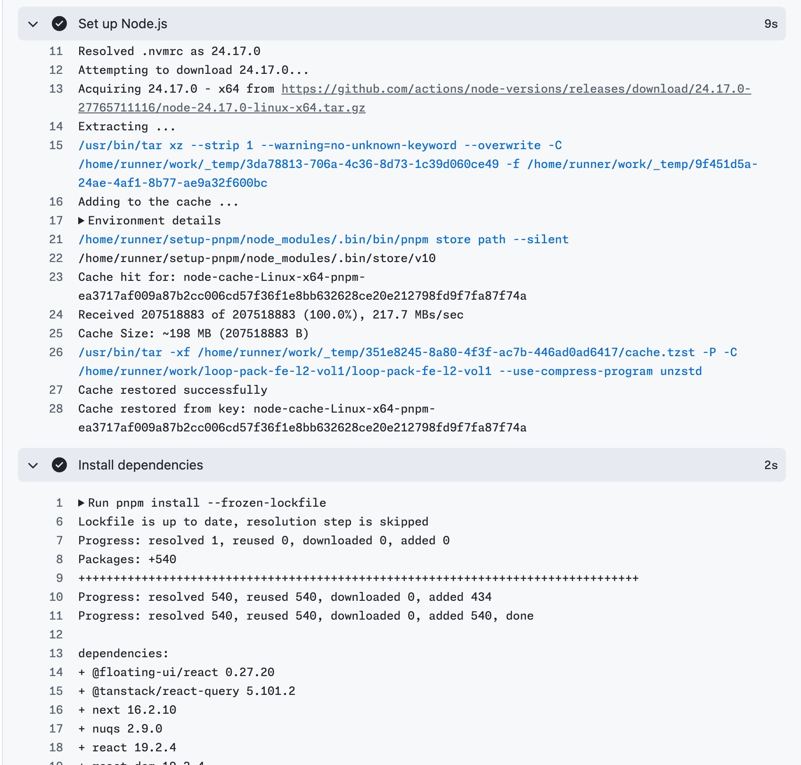
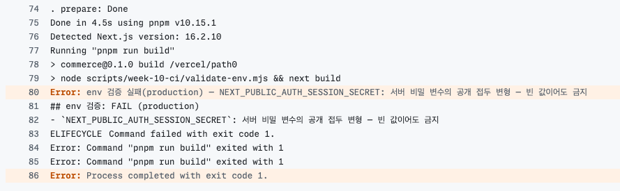

# 10주차 — CI 측정·최적화 기록

quality workflow를 측정한 뒤 job 병렬화, 중복 빌드 제거, Playwright 브라우저 캐시를 적용했다. 전체 실행 시간의 중앙값은 cold **144→94초**, warm **134→71초**로 줄었다. unit·integration, lint, typecheck, production build, E2E 검증은 모두 유지했다.

결과는 세 축으로 구분한다. 중복 workflow 제거 효과를 quality workflow 자체의 속도 개선으로 계산하지 않는다.

| 축 | Before | After |
|---|---|---|
| 전체 실행 시간 (quality run wall-clock) | cold 144초 · warm 134초 | cold 94초 (−35%) · warm 71초 (−47%) |
| PR당 러너 사용 시간 추정 | 두 workflow 합계 약 266초 | 두 job 합계 약 130초 |
| 연속 push의 중복 검증 | 이전 PR run도 계속 실행 | 같은 PR의 이전 run 취소, main run은 독립 실행 |

계획과 의사 결정은 [week10-decisions.md](week10-decisions.md)에 기록했다. 측정 프로토콜은 ADR-2·4, 실험 환경은 ADR-3을 따른다.

## 측정 조건과 판정 기준

- **대상**: fork `heeji289`의 실험 PR. upstream에서는 캐시 삭제와 재실행 권한이 없어 fork에서 측정했다.
- **전체 실행 시간**: quality workflow의 attempt별 시작부터 종료까지 걸린 시간.
- **cold**: `gh cache delete --all`로 서버 캐시를 모두 삭제한 뒤 같은 커밋에서 “Re-run all jobs”.
- **warm**: 캐시를 보존한 채 같은 커밋에서 재실행.
- **반복**: 각 조건에서 3회. [7주차 측정 방식](../week-07-performance/measure-protocol.md)을 따라 원자료·중앙값·범위를 함께 기록했다.

**판정 규칙은 After 측정 전에 고정했다.** After의 [최소, 최대] 구간이 Before보다 낮고 두 구간이 겹치지 않을 때만 “개선”으로 판정한다. 겹치면 “유의미하지 않음”으로 기록한다. 이는 3회 표본에 적용한 실무 판정 기준이며, 통계적 유의성을 검정한 결과는 아니다.

## Before — 병목 확인

2026-09-09 측정. 커밋 `08344858`, run [34329855053](https://github.com/heeji289/loop-pack-fe-l2-vol1/actions/runs/34329855053).

### 전체 실행 시간

| 조건 | 1회 | 2회 | 3회 | 중앙값 | 최소–최대 (폭) |
|---|---|---|---|---|---|
| cold — attempt 2·3·4 | 144초 | 128초 | 146초 | **144초** | 128–146초 (18초) |
| warm — attempt 5·6·7 | 151초 | 132초 | 134초 | **134초** | 132–151초 (19초) |

### step별 소요 시간

Actions 화면의 step 이름을 그대로 사용했다.

| step | cold — attempt 2·3·4 | warm — attempt 5·6·7 |
|---|---|---|
| Set up job | 1초 | 1초 |
| Checkout | 1~2초 | 2초 |
| Set up pnpm | 3~5초 | 3~8초 |
| Set up Node.js | 5~8초 | 8~9초 |
| Install dependencies | 6~7초 | **2초** |
| Install Playwright Chromium when used | 24~26초 | 23~32초 |
| **Run quality checks** | **67~89초** | **86~90초** |
| Post Set up Node.js | 4~5초 | 0초 |

`Post Set up Node.js`는 pnpm store 캐시를 저장하는 단계다. cold에서는 업로드에 4~5초가 들었고, warm에서는 기존 캐시를 사용해 저장을 건너뛰었다.

### 가장 긴 step 내부 분해

`Run quality checks`는 `pnpm check` 한 명령으로 아래 검증을 직렬 실행했다. raw 로그의 줄별 타임스탬프로 cold attempt 2와 warm attempt 6을 분해했다.

| 명령 | cold | warm |
|---|---|---|
| `pnpm test` | 23.4초 | 21.8초 |
| `pnpm lint` | 16.8초 | 16.2초 |
| `pnpm typecheck` | 4.7초 | 4.6초 |
| `pnpm build` | 11.5초 | 11.1초 |
| **`pnpm test:e2e`** | **32.7초** | **31.7초** |

가장 긴 구간은 E2E 실행 32~33초였다. 여기에 매번 반복되는 Playwright 설치 23~32초를 더하면 **E2E 준비·실행에 약 60초**, 전체 약 140초의 43%가 들었다. 설치 시간에는 브라우저 다운로드와 OS 의존성 설치가 모두 포함된다. E2E 실행에는 `webServer`가 수행하는 두 번째 production build도 포함돼 있었다.

### 캐시 이득과 실행 편차

pnpm store 캐시는 이미 적용돼 있었다. warm에서 의존성 설치는 6~7초에서 2초로 줄었지만, `Set up Node.js`의 약 198MB 캐시 복원에는 cold보다 약 2~3초가 더 들었다. 두 step만 보면 순이득은 약 2초였다. cold의 캐시 업로드 비용 4~5초는 별도로 발생했다.

전체 실행 시간의 cold·warm 구간은 겹쳤다. 이 표본만으로 pnpm 캐시가 전체 시간을 뚜렷하게 줄였다고 판단하지 않았다.

`Run quality checks` 자체도 cold 89/67/88초, warm 90/86/87초로 흔들렸다. 같은 조건에서 최대 22초 차이가 나므로 한 번의 빠른 실행을 대표값으로 삼지 않았다. 러너 성능 등 실행 환경의 영향을 의심할 수 있지만, 원인을 별도로 분리 측정하지는 않았다.

### 중복 workflow 확인

4주차의 `ci.yml`은 lint·unit·E2E를, 5주차의 `quality.yml`은 `pnpm check` 전체를 실행했다. `ci.yml`의 검증은 quality의 부분집합이어서 PR마다 lint·unit·E2E가 두 번씩 실행됐다. Node 버전도 `ci.yml`의 22와 `.nvmrc` 기준이 달랐다.

두 workflow는 병렬로 실행되므로 `ci.yml` 삭제 효과는 **러너 사용 시간 절감**으로 기록한다. 이를 quality workflow의 wall-clock 단축으로 계산하지 않는다.

## 전략 선택

2026-09-09, Before 측정 직후 아래 세 전략을 함께 적용하기로 결정했다. 예상치는 당시의 가설로 남기고, 실제 결과와 구분한다.

| 전략 | 대응하는 비용 | 당시 예상 |
|---|---|---|
| Playwright 브라우저 캐시 | 매번 반복되는 브라우저 다운로드 | 20~25초 단축 — OS 의존성 비용을 충분히 반영하지 못한 예상 |
| `checks` ∥ `build-e2e` 병렬화 | unit·lint·typecheck와 build·E2E의 직렬 실행 | 전체 완료를 결정하는 경로에서 약 44초 분리 |
| CI의 중복 build 제거 | Build 직후 E2E의 `webServer`가 다시 build | 8~10초 단축 |

과제에서 제시한 job 병렬화와 concurrency는 채택했다. pnpm store 캐시는 이미 적용돼 있었고 관찰한 순이득도 작아 추가 보강하지 않았다. concurrency의 목적과 검증은 [별도 절](#concurrency--pr의-중복-검증-취소)에 정리했다.

### job은 둘로, build와 E2E는 같은 job으로

`checks`에는 unit·integration, lint, typecheck를 두고, `build-e2e`에는 production build와 E2E를 뒀다. 두 job은 독립적으로 실행한다.

job마다 준비·설치에 약 20초가 들기 때문에 lint 약 17초나 typecheck 약 5초까지 별도 job으로 나누지는 않았다. 더 잘게 나눴을 때의 전체 시간은 별도로 측정하지 않았다. job 안에서 test와 lint를 동시에 실행하는 방안도 vitest의 CPU 사용량이 높다는 관찰(로컬 약 448%)을 고려해 채택하지 않았다.

build와 E2E는 `.next` 산출물로 연결돼 있다. 별도 job으로 나누면 다시 빌드하거나 artifact로 전달해야 하므로 같은 job에 유지했다. 대신 **Build와 E2E를 별도 step으로 나눠 시간과 실패 위치를 확인**한다. CI의 Playwright `webServer`는 `pnpm start`만 실행한다.

### 추가하지 않은 최적화

- **job 간 setup·install 공유**: 각 job은 별도 VM에서 실행한다. pnpm store 캐시는 두 job에서 복원하되, `node_modules` artifact 전송이나 선행 준비 job은 추가하지 않았다. warm install이 2초인 상황에서 전송·준비 단계를 늘릴 근거가 부족했다.
- **커스텀 러너 이미지**: 준비 비용을 줄일 수 있지만 개인 레포에서 이미지 관리까지 도입하지 않았다.
- **Next.js build 캐시**: 측정한 build가 약 11초여서 이번에는 적용 범위를 늘리지 않았다.
- **검증 축소**: Before와 같은 검증 항목을 유지한다는 측정 조건에 따라 제외했다.

단독 전략별 A/B 실험은 하지 않았다. 아래 After 결과는 세 전략을 함께 적용한 결과이며, 각 전략의 효과는 관련 step의 변화로 해석한다.

workflow 통합과 함께 job timeout을 10분으로 설정했다. Before warm 중앙값 2분 14초의 약 4.5배를 여유로 둔 값이다.

## After — 같은 조건에서 재측정

2026-09-09 측정. 커밋 `5cadb544`, PR #3, run [34357394959](https://github.com/heeji289/loop-pack-fe-l2-vol1/actions/runs/34357394959)의 attempt 2~7. Before와 동일하게 cold·warm 각 3회를 측정했다.

### 전체 실행 시간 비교

| 조건 | Before 원자료 (중앙값) | After 원자료 (중앙값) | 판정 |
|---|---|---|---|
| cold | 144/128/146초 (**144초**) | 94/91/110초 (**94초**) | [128,146]과 [91,110]이 겹치지 않음 — **50초·35% 단축** |
| warm | 151/132/134초 (**134초**) | 69/83/71초 (**71초**) | [132,151]과 [69,83]이 겹치지 않음 — **63초·47% 단축** |

unit·integration, lint, typecheck, production build, E2E는 Before와 After에서 모두 실행했다. 검증을 제거하거나 축소해 얻은 단축은 없다.

### 병렬화와 중복 build 제거

| 관찰 대상 | Before | After |
|---|---|---|
| 검증 실행 구조 | `pnpm check`에서 직렬 실행 | `checks` 63~73초 ∥ `build-e2e` 64~104초 |
| E2E step | 32~33초 — 재빌드 포함 | 20~22초 — 기존 빌드 사용 |
| Build step | `pnpm check` 내부 11초대 | 독립 step 11~13초 |

두 job의 실행 구간이 겹치면서 전체 완료 시간은 주로 더 늦게 끝나는 job에 좌우됐다. workflow 전체 시간에는 job 시작 시차 등도 포함되므로 job 소요 시간의 최댓값과 정확히 같지는 않다. E2E의 약 10초 단축은 중복 build 제거의 예상과도 맞았다.

job 분리로 늘어난 설치 비용도 확인했다. warm의 `Install dependencies`는 두 job에서 **각 2초**, 합계 약 4초였다. 이 실행에서는 설치 중복이 전체 시간 단축을 상쇄하지 않았다.

### Playwright 캐시는 유지할 가치가 있었나

같은 After run의 miss attempt 2·3·4와 hit attempt 5·6·7을 비교했다.

| 비교 구간 | 원자료 | 중앙값 |
|---|---|---|
| 새 설치: 브라우저 + OS 의존성, 캐시 저장 제외 | 26/27/38초 | **27초** |
| hit 전체: 캐시 복원 + OS 의존성 + 캐시 후처리 | 14/20/15초 | **15초** |

hit의 구성은 복원 2~7초, OS 의존성 설치 11~13초, 캐시 후처리 0~1초였다. miss에서는 새 설치 외에 캐시 저장 비용 **3~6초**가 추가됐다.

[Playwright 공식 문서](https://playwright.dev/docs/ci#caching-browsers)는 복원 시간이 다운로드 시간과 비슷할 수 있고 Linux의 OS 의존성은 캐시할 수 없다는 이유로 브라우저 캐시를 권장하지 않는다. 사용한다면 Playwright 버전에 맞춰 캐시 키를 구분하도록 안내한다. 현재 구현은 버전 키를 사용하며 hit에서도 `install-deps chromium`을 실행한다.

**새 설치 27초(캐시 저장 제외) 대비 hit 전체 15초로, 설치 관련 구간에서 약 12초의 이득을 관찰해 캐시를 유지했다.** 예상했던 20~25초보다 작았던 이유는 hit에도 OS 의존성 설치가 남기 때문이다. 표본은 각 3회이며 항상 같은 이득을 보장하지 않는다. miss가 잦으면 저장 비용 때문에 손해일 수 있다.

이 비교는 브라우저 바이너리 다운로드만의 시간이 아니라 **설치 관련 구간 전체**의 비교다. 전체 workflow의 단축분에는 pnpm 캐시 상태와 다른 최적화도 영향을 주므로 이를 모두 브라우저 캐시 효과로 계산하지 않는다.

공식 컨테이너 이미지도 검토했지만 이번에는 도입하지 않았다. 이미지 pull 비용과 `.nvmrc`에 맞춘 Node 설정을 추가로 확인해야 하며, 현재 캐시보다 빠른지는 측정하지 않았다.

### 러너 사용 시간 추정

Before는 PR당 quality 약 134초와 `ci.yml` 약 132초를 합쳐 **약 266초**, After는 warm의 `checks` 약 64초와 `build-e2e` 약 65초를 합쳐 **약 130초**로 추산했다.

중복 workflow 삭제와 실행 효율화로 사용 시간도 약 절반으로 줄었다. 이 수치는 대표 소요 시간으로 계산한 추정치이며, 실제 청구 시간을 집계한 값은 아니다.

## 캐시 키 검증 — hit, miss, 원복

### pnpm store의 hit 확인

Before warm에서 다음 로그를 확보했다.

| 관찰 지점 | warm | cold — attempt 2 |
|---|---|---|
| Set up Node.js | `Cache hit for: node-cache-Linux-x64-pnpm-ea3717af…`, 약 198MB 복원 | `pnpm cache is not found` |
| Install dependencies | `reused 540, downloaded 0` — 2초 | `downloaded 540` — 6~7초 |

install step에서 관찰한 차이는 4~5초다. 캐시 복원과 저장 비용은 이 차이에 포함하지 않는다.

### lockfile 변경으로 miss 재현

2026-09-09, 커밋 `7b1c55a5`에서 lockfile 끝에 YAML 주석 한 줄을 추가했다. 의존성 정의는 유지하면서 파일 내용의 해시만 바꾸기 위해서다. `--frozen-lockfile` 검증도 통과했다.

변경 후 run [34363213822](https://github.com/heeji289/loop-pack-fe-l2-vol1/actions/runs/34363213822)에서 다음을 확인했다.

| 관찰 지점 | 기존 warm | lockfile 변경 후 |
|---|---|---|
| Set up Node.js | `Cache hit for: node-cache-…` | `pnpm cache is not found` |
| Install dependencies | `reused 540, downloaded 0` — 2초 | `reused 0, downloaded 540` — 6.4초 |

같은 run의 브라우저 캐시는 `playwright-browsers-Linux-1.61.1` 키로 hit했다. lockfile 주석 변경으로 Playwright 버전은 바뀌지 않았으므로, pnpm store만 miss가 발생했다.

커밋 `a098c839`에서 주석을 제거한 뒤 run [34363761765](https://github.com/heeji289/loop-pack-fe-l2-vol1/actions/runs/34363761765)이 green으로 끝났고 install도 **2초로 복귀**했다. 이 실험으로 lockfile 내용이 pnpm store 캐시 키에 반영되며, 브라우저 캐시는 별도의 버전 키를 사용함을 확인했다. 실험용 주석은 남아 있지 않다.

## concurrency — PR의 중복 검증 취소

### 이벤트별 정책

| 이벤트 | group 예시 | 동작 |
|---|---|---|
| PR push | `Quality-refs/pull/N/merge` | 같은 PR의 이전 run을 취소하고 최신 변경 검증 |
| main push | `Quality-<run_id>` | 서로 다른 그룹으로 독립 실행, 후속 push에 의한 concurrency 취소 방지 |

`cancel-in-progress: false`만으로는 같은 그룹의 대기 run까지 보호할 수 없다. 기본 큐에서는 한 run이 실행 중이고 다른 run이 대기할 때 세 번째 run이 들어오면 기존 대기 run을 대체한다. main에는 서로 다른 `run_id`를 사용해 이 충돌을 피했다.

GitHub은 `queue: max`로 여러 run을 대기시키는 방식도 지원한다. 다만 현재 검증은 독립된 러너와 로컬 서버에서 실행하므로 직렬로 대기시킬 필요가 없다. 이 정책은 배포 순서를 제어하는 설정과는 별개다. [GitHub concurrency 문서](https://docs.github.com/en/actions/how-tos/write-workflows/choose-when-workflows-run/control-workflow-concurrency)

### main의 각 push를 검증하는 이유

최신 run만으로도 최신 코드의 상태는 확인할 수 있다. 이 프로젝트에서는 PR의 핵심 E2E를 main의 전체 E2E로 보완할 계획이므로, 각 push의 검증 결과를 남기기로 했다. 실패 원인인 머지를 찾거나 flaky 결과를 대조할 때도 도움이 된다.

이는 머지된 코드의 검증 기록이며, 실제 Production 배포 환경을 테스트했다는 뜻은 아니다. main run을 모두 유지하면 그만큼 러너를 사용한다. 현재 규모에서는 이를 수용하되, 머지 빈도가 높아지면 최신 run만 검증하는 정책과 다시 비교한다.

### 도입 근거와 검증 범위

“연속 push가 잦다”는 초기 가정과 달리, upstream round-6~9 브랜치의 **32 run 중 겹침은 2건**이었다. 큰 절감 효과를 입증한 것은 아니다. 기존 workflow에 간단한 설정을 추가해 연속 push 때의 중복 검증을 줄이는 목적으로 유지했다.

PR의 이전 run 취소는 문서 마감 커밋 두 건을 시차를 두고 push해 재현했다. 취소된 run 목록 캡처는 PR 본문에 첨부했다. main은 비취소를 별도로 실측하지 않았으며, 서로 다른 그룹을 사용한다는 설정 근거로 판단했다. 후속 main push에 의한 concurrency 취소는 피하지만, 수동 취소나 timeout까지 막는 것은 아니다.

## 2단계 — 조건부 실행

2026-09-10 구현. **실제 PR·Actions 검증과 시간 측정은 아직 진행하지 않았다.** 실행 정책은 [2단계 스펙](../../specs/260910-week10-step2-conditional-ci.spec.md), 선택 근거는 [ADR-6~10](week10-decisions.md)에 기록했다.

1단계에서는 같은 검증을 더 빨리 실행했다. 2단계에서는 변경 영향과 실행 시점에 따라 검증 범위를 나눴다. 따라서 이후의 시간 차이는 1단계의 동일 조건 Before/After와 구분해 기록한다.

### 어떤 검증을 언제 실행하는가

기존 Quality workflow를 유지했다. lint·typecheck·unit 전체와 production build는 모든 PR에서 실행하고, integration과 E2E의 범위를 조절한다.

| 실행 | integration | E2E | Lighthouse | Production 배포 |
|---|---|---|---|---|
| main 대상·준비 완료·런타임 변경 PR | 변경 관련 | 로그인·주문 핵심 3개 | 없음 | 없음 |
| 문서 전용·draft·main 외 PR | 변경 관련, 문서 전용은 생략 | 생략 | 없음 | 없음 |
| main push | 전체 | 전체 | 없음 | 필수 검증 성공 후 |
| 정기·수동 실행 | 전체 | 전체 | 홈·상품 목록 | 없음 |

정기는 매주 월요일 **03:30 KST**에 main을 검증한다(일요일 18:30 UTC, `30 18 * * 0`). 수동 실행은 선택한 브랜치를 검증한다. 작업 브랜치에서도 병합 전에 전체 E2E와 Lighthouse를 확인할 수 있도록 main으로 제한하지 않았다.

같은 PR의 이전 run은 취소한다. main·정기·수동 실행은 서로 다른 그룹으로 두어 이 concurrency 설정 때문에 검증이 취소되지 않게 했다.

### 변경 관련 integration을 고르는 방법

먼저 테스트를 책임에 따라 나눴다. node/jsdom은 실행 환경 구분으로 유지했다.

| 분류 | 기준 | 현재 파일 수 |
|---|---|---|
| unit | 순수 계산·단일 모듈 계약. URL 파서, API 클라이언트, 공용 UI 훅 등 | 21개 |
| integration | 화면·상태·API의 연결. 페이지, API route, 상태 복원 등 | 25개 |

로컬에서 `vitest list`로 두 집합의 합이 기존 46개 파일과 일치함을 확인했다. integration으로 분류하지 않은 테스트는 unit에 포함해 항상 실행한다. 로컬 `pnpm test`와 `pnpm check`도 전체 검증을 유지한다.

변경 파일은 `dorny/paths-filter`로 수집하고, 관련 테스트는 Vitest의 import 관계로 찾는다. 테스트에 쓰이지 않는 문서 Markdown과 루트 안내 문서만 제외한다. 소스·설정·자산·미분류 파일은 검증 대상으로 남긴다.

| 변경 내용 | integration 실행 |
|---|---|
| 문서만 변경 | 생략하고 이유 기록 |
| 일반 소스·테스트 변경 | `vitest related`로 관련 테스트 실행 |
| 공통 setup·MSW·빌드 설정·lockfile | 전체 |
| 삭제 등으로 관계를 복원할 수 없거나 import 그래프 밖인 파일 | 전체 |
| 어느 변경 파일이든 관련 테스트가 0개 | 전체 실행, 테스트 공백 가능성 기록 |

관련성은 파일별로 확인한다. 여러 변경을 한꺼번에 넣으면 한 파일의 선택 결과가 다른 파일의 테스트 공백을 가릴 수 있기 때문이다. 파일별 확인은 실행 없이 수집만 하는 선택 프로브(어떤 테스트 이름과도 안 맞는 `-t` 필터)로 하고, 실행은 확인이 끝난 뒤 합집합으로 한 번만 한다. 같은 테스트의 중복 실행이 없고, 유일한 실행의 종료 코드가 그대로 결과라 앞선 실패가 재실행에 덮이는 경로가 없다. 프로브도 setup과 모듈 최상위 코드는 실행하므로 수집 예외는 즉시 실패로 처리하고, 프로브 선택과 실행 선택의 집합이 다르면 판별 실패다. 파일 수 상한은 두지 않는다 — 비용을 이유로 related 정책을 철회하지 않는다.

파일 목록은 JSON으로 전달한다. 조회 실패·목록 누락·리포트 수집 실패는 생략 성공으로 처리하지 않는다. 이름 변경은 이전·새 경로를 모두 받도록 했으며, 실제 PR에서의 출력 대조는 남아 있다.

로컬 확인 결과는 다음과 같다. Actions에서 같은 결과가 나오는지는 아직 확인하지 않았다.

| 입력 | 확인 결과 |
|---|---|
| 상품 queries / login-url | 각각 integration 16개 / 8개 파일 선택 |
| layout 단독 / layout + ProductList | 관련 테스트가 없는 파일을 찾아 전체 실행 |
| E2E 파일·lockfile·존재하지 않는 파일 | 전체 실행 |
| 상품 queries + login-url 동시 변경 | 프로브로 16·8개 확인 후 합집합 18개를 1회 실행 |

### 핵심 E2E와 병합 보호

핵심 범위는 로그인 성공·실패 2개와 주문 완료 1개다. auth·order 그룹의 `@critical` 태그로 선택하고, 실행 결과에서 3개가 실제 통과했는지 확인한다. 태그 누락이나 skip·fixme·예상 실패 표시는 핵심 검증 완료로 인정하지 않는다.

문서 전용·draft·main 외 PR에서는 브라우저 준비와 E2E를 생략한다. 문서는 실행 코드를 바꾸지 않으며, draft와 main 외 PR은 main 병합 준비가 끝난 상태가 아니기 때문이다. ready 전환이나 대상 브랜치 변경 시 조건을 다시 판단한다. 별도 라벨은 사용하지 않는다.

`guard`는 변경 판별·기본 검사·build·E2E 결과를 대조한다. 필요한 E2E가 실패하거나 예상과 달리 생략되면 실패하고, 의도한 생략일 때만 성공한다. 변경 판별이 실패해도 기본 검사와 build는 실행하도록 했다.

**main의 required 설정은 적용 완료다.** strict(최신 main 반영 요구)와 `checks`·`guard`를 required로 연결했다. guard는 체크 이름이 첫 실행 전에는 설정 화면에 나타나지 않아 구현 PR의 첫 CI 실행 뒤에 추가했다. 다른 PR이 먼저 병합되면 남은 PR도 main을 반영한 뒤 다시 검증해야 한다. 개인 소유 fork는 merge queue 지원 대상이 아니어서 `merge_group` 대신 이 방식을 선택했다. 지원 범위와 근거는 [스펙](../../specs/260910-week10-step2-conditional-ci.spec.md#further-notes)에 남겼다.

### 전체 E2E와 Production 배포

main 자동 Git 배포를 끄고, 기본 검사·build·전체 E2E 성공 후 CI에서 배포하도록 구성했다. 전체 E2E는 현재 로그인·주문·세션 만료·상품 목록·Dialog를 검증한다. 파일 목록은 자동 수집하고, 실행 누락과 스킵도 확인한다.

배포에는 검증한 커밋을 사용한다. 게시 job을 직렬화하되 대기열은 `queue: max`로 넓혔다 — 기본값(single)은 pending 1개만 유지해 늦게 도착한 과거 run이 대기 중인 최신 배포를 취소할 수 있다. 시작 시 최신 main과 SHA를 대조해 늦게 끝난 이전 run이 최신 배포를 덮지 않도록 했다. 배포 자격 증명은 소유 fork의 main push 배포 단계에서만 사용한다. secrets는 등록했고, 실제 배포 차단·게시 순서 검증은 남아 있다.

이 정책이 모든 회귀의 main 유입을 막는 것은 아니다. **main 병합 전에는 핵심 흐름을, Production 배포 전에는 전체 흐름을 검증한다.** 비핵심 E2E가 발견하는 오류는 main에 들어갈 수 있으며, 배포 전 전체 검증으로 사용자 노출을 막는 것이 목표다.

### flaky와 성능 측정

E2E 재시도는 CI에서만 2회, 로컬에서는 0회로 설정했다. 재시도 후 성공은 flaky로 따로 표시하고, 지속 실패는 검증 실패로 남긴다. 실패 분석용 리포트·trace를 보관하며 인증 상태 파일은 제외한다.

같은 테스트가 서로 다른 CI 실행에서 2회 이상 flaky이면 자동 대기와 상태 격리를 먼저 점검하고, 원인·실행 링크·복구 작업을 로컬 이슈에 남긴다. 핵심 또는 해당 변경을 검증하는 테스트는 대체 검증 없이 격리한 채 병합·배포하지 않는다.

Lighthouse는 정기·수동 실행에서 홈과 상품 목록을 각각 3회 측정한다. 리포트는 30일간 보관한다. PR required나 배포 조건에는 넣지 않았으며, 성능 임계값은 3단계에서 다룬다.

### 남은 검증

아래 항목은 모두 **대기** 상태다. 각 결과에 PR·run URL과 대상 SHA를 붙여 완료 여부를 기록한다.

| 항목 | 확인할 내용 |
|---|---|
| 실행·생략 PR | 코드 PR과 문서 PR의 선택 목록·E2E 실행 여부, draft·base 전환 재판정 |
| 관련 테스트의 검출력 | 상품 개수 표시에 오류를 넣어 기존 테스트의 실패 확인, 복구 후 같은 선택 조건에서 통과 |
| 필터 경계 | 문서+코드·공통 설정·미분류·삭제·이름 변경의 선택 및 전체 실행 |
| 병합 보호 | required·strict 적용, 실패 시 병합 차단, 다른 PR 병합 후 최신 main 반영·재검증 |
| Production | secrets·산출물 호환 확인, E2E 실패 시 배포 차단, 정상 배포의 SHA·시간·게시 순서 |
| 정기·수동 | main·작업 브랜치 수동 검증과 배포 미실행, 실제 첫 schedule run |
| flaky | 일회성 실패의 재시도 성공과 지속 실패, 결과 요약·trace 확인 |
| 실행 비용 | 같은 커밋·CI 조건에서 전체 검증과 unit 전체+관련 integration을 각 3회 비교. 원자료·중앙값·범위·판별 비용 기록 |

실험 후에는 의도적으로 넣은 오류를 제거하고 최종 `pnpm check`를 실행한다. 수동 실행 결과를 실제 schedule 실행 증거로 대신하지 않는다.

### 실증 기록 1차 (2026-09-10)

- **코드 PR의 조건부 실행** — [PR #4](https://github.com/heeji289/loop-pack-fe-l2-vol1/pull/4), [run 34435589309](https://github.com/heeji289/loop-pack-fe-l2-vol1/actions/runs/34435589309): 변경 16개를 런타임 13·문서 3으로 분류. 전체 영향 경로(quality.yml·package.json·vitest.config.ts) 검출로 integration 전체 폴백(25개 통과), 핵심 E2E 3개 실행·통과(flaky 0), guard PASS. checks·build-e2e 병렬로 전체 약 1분 30초.
- **required·strict 설정** — main branch protection에 `checks`·`guard` required와 strict 적용을 API로 확인: `{"contexts":["checks","guard"],"strict":true,"enforce_admins":true}`. guard는 첫 실행 전 설정 화면에 나타나지 않아 PR #4의 첫 run 후 추가했다. PR #4는 required 충족으로 MERGEABLE/CLEAN.
- **배포 게이트 첫 실전** — 병합 커밋 `be3ec589`의 [run 34437046969](https://github.com/heeji289/loop-pack-fe-l2-vol1/actions/runs/34437046969): 통합 전체·전체 E2E 5종 16개 통과(passed 16·flaky 0·skipped 0, full 모드 실행 검증 포함) 후 같은 SHA를 Production에 게시 — https://loop-pack-fe-l2-vol1.vercel.app. Vercel secrets 오류(ID 불일치→토큰 scope)로 deploy가 2회 실패하는 동안 검증 계층은 초록, 배포 단계만 빨간불로 남고 기존 Production이 유지됐다 — 배포 실패가 침묵 통과로 바뀌지 않는 동작의 실측 증거.
- ~~남은 항목(문서 PR 생략·draft/base 재판정·오류 검출·strict 재검증·비핵심 E2E 배포 차단·정기/수동·측정)은 위 표의 대기 상태를 유지한다.~~ → 2차에서 완료.

### 실증 기록 2차 (2026-09-10)

- **문서 전용 PR** — [PR #5](https://github.com/heeji289/loop-pack-fe-l2-vol1/pull/5), run 34438250214: 문서 1·런타임 0 분류, integration "판별 성공·의도된 생략", E2E 생략(문서 전용), guard PASS, 머지 가능.
- **draft↔ready** — [PR #6](https://github.com/heeji289/loop-pack-fe-l2-vol1/pull/6): draft run에서 관련 integration 2개만 선택(무관 23개 제외)·E2E 생략(draft) → ready 전환 run 34438572260에서 같은 diff에 핵심 E2E 3개 실행·통과.
- **오류 검출·차단·복구** — 커밋 3134a092(개수 +1): 관련 2개 선택, 기존 테스트 9개가 불일치 검출 실패(run 34438718419), guard FAIL·PR BLOCKED. 핵심 E2E는 통과 — 층 분리 확인. 원복 5104fb35 후 같은 선택 조건에서 통과(run 34438884451).
- **strict 재검증** — A(#5)·B(#6) 모두 CLEAN → A 머지 → B `BEHIND` 차단 → Update branch(f0eb3a2b) → 재검증 run 34439119718 → 머지.
- **base 재지정** — [PR #8](https://github.com/heeji289/loop-pack-fe-l2-vol1/pull/8): main 외 대상에서 E2E 생략(run 34441289636) → base를 main으로 변경(edited) → 핵심 E2E 재실행(run 34441470263).
- **필터 반례** — [PR #7](https://github.com/heeji289/loop-pack-fe-l2-vol1/pull/7): 테스트 파일 자체 변경 → 자기 선택 1개(run 34440565350) / rename → paths-filter가 added+deleted 2경로로 펼침을 실측, 이전 경로 부재로 전체 폴백(run 34440694804 — 대조 확정) / tests/msw 변경 → 전체 영향 폴백(run 34440838760) / classify 강제 실패 → changes 실패에도 unit·lint·typecheck 실행 유지, integration step 실패·guard FAIL·BLOCKED(run 34440961662) / 로그인 픽스처 오류 → 핵심 E2E 실패(재시도 2회 소진 후 failed — retry 정책 실측), guard FAIL·BLOCKED(run 34441105276).
- **배포 차단·복구** — [PR #9](https://github.com/heeji289/loop-pack-fe-l2-vol1/pull/9)(비핵심 dialog 스펙 의도적 실패)는 PR 검증을 통과해 머지 → main run 34441821105에서 전체 E2E 실패·deploy skipped·Production `dpl_4sTRk6Up` 유지 → 원복 [PR #10](https://github.com/heeji289/loop-pack-fe-l2-vol1/pull/10) 머지 → run 34442109441 green·새 배포 `dpl_974UBU3Z`. 합의한 안전 경계(비핵심 회귀는 main 유입 가능, 배포 전 차단) 그대로.
- **수동 dispatch** — run 34442293948(workflow_dispatch, main): 전체 E2E 16개·Lighthouse 홈·상품 각 3회 성공, 리포트 artifact 업로드, deploy skipped.
- **측정** — 같은 내용 계열 커밋·같은 날 CI에서 각 3회. integration step: 관련 선택(2개) 6/6/5초(중앙 6) vs 전체(25개) 16/17/16초(중앙 16) — 구간 비겹침, 10초·63% 단축. checks job 전체: 52 vs 64초(중앙값). 판별 비용: changes job 8/6/11초(중앙 8, 병렬 job이라 wall-clock에 거의 흡수). 선택 사례는 소형 diff 기준이며 전체 영향 경로가 섞인 PR은 폴백으로 이득이 없다 — related는 측정과 무관하게 기본 정책(ADR-7).
- **남은 대기**: 실제 첫 schedule run(월 03:30 KST), freshness 경쟁 재현(타이밍 의존·선택), flaky 발생 시 기록.

### 실증 기록 3차 (2026-09-10) — 실제 변경 기반 재실증

주석 변경만으로는 "실제 변경이 올바른 테스트를 만나는지"의 증거가 약해, 실사용 변경 두 건으로 다시 검증했다.

- **로그인 화면 가운데 정렬** — [PR #12](https://github.com/heeji289/loop-pack-fe-l2-vol1/pull/12), run 34443456604. 실제 디자인 결함 수정(1280px에서 왼쪽 정렬, before/after 스크린샷 확인). `home.css`는 root layout이 import해 테스트 그래프 밖이라 파일별 프로브가 관련 0개를 검출 → **integration 전체 폴백**(이유에 home.css 명시) + 핵심 E2E 실행. 합산 판별이었다면 LoginPage.tsx의 선택이 이 공백을 가렸을 사례가 실전에서 나왔다.
- **장바구니 전체 선택** — [PR #13](https://github.com/heeji289/loop-pack-fe-l2-vol1/pull/13), run 34443836321. 실제 기능 추가(테스트 선작성 빨간불 → 초록). CartPage·cart-store·CSS module·페이지 테스트 변경 → **cart 관련 13개만 정밀 선택**. 선택 13개는 cart-store를 import하는 5곳(CartPage·상품 카드의 담기 버튼·header 배지·OrderForm·providers)의 정적 사슬로 전부 설명되고 — HomePage·home-error가 포함된 이유도 홈 상품 카드의 담기 버튼이다. 제외 12개의 무관성: orders-page(내역은 API 조회)·my-page·로그인 계열·search-params(무관 도메인)·wishlist/checkout-store(자기 스토어만 검증)·API route 4개(클라이언트 store와 정적 무관 — 주문 흐름은 같은 run의 핵심 E2E가 커버). 같은 CSS라도 컴포넌트가 import하는 CartPage.module.css는 그래프 안(3개 선택), 전역 home.css는 그래프 밖(전체 폴백)이라는 대비도 확보했다.
- **작업(dev·통합) 브랜치 정책** — 검증은 PR 단위다: 브랜치 직접 push는 workflow를 트리거하지 않고(`on.push`는 main뿐), 작업 브랜치 **대상** PR은 기본 검사·관련 integration을 그대로 실행하며 E2E만 생략한다(2차의 PR #8 실증 — unit 21·관련 8 실행 로그). dev에 쌓인 변경을 main으로 올리는 PR은 누적 전체 diff로 판별되어 그 시점에 핵심 E2E가 걸린다.

## 3단계 — env 게이트

### 게이트 구성

**2026-09-11 변경:** env 검증은 Next.js 생명주기에서 호출한다. `src/env/validate.ts`의 규칙은 import만으로 실행되지 않으며, Zod는 서버 실행에도 필요해 기존 버전을 dependencies로 옮겼다. 클라이언트는 검증 모듈을 import하지 않는다.

| 시점 | 호출 지점 | 검사 대상 |
| --- | --- | --- |
| 개발/프로덕션 빌드 | `next.config.ts`의 해당 phase | APP_ORIGIN, 알려진 비밀 변수의 NEXT_PUBLIC_ 변형 |
| Node 서버 인스턴스 시작 | `src/instrumentation.ts`의 `register()` | APP_ORIGIN, AUTH_SESSION_SECRET, 비밀 공개 변수 |

APP_ORIGIN은 루트 metadata에서도 읽어 빌드와 서버 양쪽에 필요하다. AUTH_SESSION_SECRET은 요청 처리용이라 빌드에서 요구하지 않는다. 서버의 인증값 누락·공백 및 배포용 기본값 오류는 요청 처리 전에 종료 코드 1로 중단한다. 실제 Next 16.2.10의 `next start`는 register 예외만 던지면 Ready 로그 이후 프로세스를 유지하는 것을 확인해, Node register에서 검증 실패를 출력하고 명시적으로 종료한다. Ready 로그 자체는 기동 성공의 판정 기준으로 쓰지 않는다. Preview의 origin 생략 허용과 설정 시 주소 대조는 유지한다.

`dev`·`start`는 Next 명령을 직접 호출하고 Next의 `.env*` 로딩을 사용한다. `scripts/week-10-ci/validate-env.mjs`는 같은 함수를 호출하는 독립 CLI·테스트용 진입점으로만 남기며, 기본은 서버 검사, `--build`는 빌드 검사, `--dev`는 개발 env 로딩이다. 오류에는 변수명·이유만 남긴다. CI는 `.env.example`의 격리값을 사용하고 Vercel 빌드·서버는 실제 대상 환경값을 사용한다.

빌드용 env 실패는 기존 build-e2e·guard·배포 경로에 전파된다. 모든 PR에서 빌드 산출물로 실제 서버 env 실행 검사를 수행한다. Production은 `--prod --skip-domain`으로 후보를 만든 뒤 `check-deployment.mjs`가 동적 인증 API의 HTTP 401·앱 JSON 본문을 확인한다. 최신 main SHA를 다시 대조한 뒤 검증한 동일 배포만 promote하므로, 런타임 env 오류로 기동하지 못하는 후보는 운영 도메인에 연결되지 않는다. 원격 실패·복구 실증은 아래 과거 기록과 분리해 갱신한다.

### 생명주기 변경 검증

- env·번들 CLI 테스트 31개, lint·typecheck 통과. 런타임 시크릿 없이 빌드하는 새 테스트의 실패를 먼저 확인한 뒤 구현으로 통과시켰다.
- `AUTH_SESSION_SECRET=''`로 실제 `pnpm build` 실행: 프로덕션 빌드·번들 예산 모두 통과.
- 실제 Next 16.2.10 프로세스 실행(Node 22.23.1, localhost): Production start의 빈 시크릿·잘못된 origin, dev의 잘못된 origin·빈 시크릿 모두 종료 코드 1 확인. 타임아웃에 의한 강제 종료는 성공으로 인정하지 않았다.
- 같은 프로덕션 산출물에 정상 env를 주입해 홈 HTTP 200과 `/api/auth/me`의 비로그인 HTTP 401·응답 본문 확인. 검증 프로세스는 종료했다.
- 최초 서버 검증은 register 예외 후에도 프로세스가 유지돼 실패했다. `register()`에서 검증 오류를 출력하고 종료하도록 수정한 뒤 위 5개 시나리오가 통과했다.
- 원격 Vercel의 새 배포·콜드 스타트 실증은 이번 로컬 검증에 포함하지 않았다. 아래 PR·배포 실증은 변경 전 구현의 기록이다.

### required 판단 — 별도 check를 만들지 않았다

| 축 | 근거 |
|---|---|
| 실행 비용 | CI 실측 약 0.1초 (run 34487715872 Build step: 14:15:24.697 시작 → 24.796 PASS). Vercel 원격 빌드에서도 약 0.16초 |
| 실패 변동성 | 결정적 — 네트워크·외부 서비스 의존이 없는 스키마 검증이라 flaky 요인이 없다 |
| 현재 실패 리스크 | 오설정일 때만 실패. 정상 상태 오탐 0 (PR #18 초록 실증) |

빌드용 env 검사는 build-e2e job의 Build step에서 Next 설정을 읽을 때 실행되므로 실패가 그대로 build-e2e 실패 → 이미 required인 guard 실패로 전파된다. 0.1초짜리 검사에 별도 required check·job을 만들면 관리 비용만 늘어 기존 guard 전파로 충분하다고 판단했다.

### 실증 기록 (2026-09-10)

- **정상 PR 초록** — [PR #18](https://github.com/heeji289/loop-pack-fe-l2-vol1/pull/18) (`8606734c`), [run 34487715872](https://github.com/heeji289/loop-pack-fe-l2-vol1/actions/runs/34487715872): changes·checks·build-e2e·guard 전부 통과, deploy는 PR이라 의도된 생략. Vercel Preview 배포도 성공 — 정상 설정에서 게이트가 소음을 만들지 않는다.
- **오류 PR 빨간불·병합 차단** — [PR #19](https://github.com/heeji289/loop-pack-fe-l2-vol1/pull/19) (`186fbd90`, 머지 금지 실험): `.env.example`에 `APP_ORIGIN=ftp://…`(http/https 외)와 `NEXT_PUBLIC_AUTH_SESSION_SECRET=`(비밀 변수의 공개 접두 변형, 빈 값) 주입. [run 34488205085](https://github.com/heeji289/loop-pack-fe-l2-vol1/actions/runs/34488205085)에서 Build step이 두 오류의 변수명·이유를 출력하고 exit 1 — `next build` 미시작(로그에 "Creating an optimized production build" 없음), build-e2e FAIL → guard FAIL → PR `BLOCKED`. **checks job(unit·lint·typecheck·CLI integration)은 같은 run에서 통과** — env 오류가 build 게이트에서만 정확히 걸리는 층 분리.
- **Vercel 배포 단계 차단** — 같은 실험 PR에서 Preview 환경변수 `APP_ORIGIN`을 타 환경 주소(`https://loop-pack-fe-l2-vol1.vercel.app`)로 오설정하고 커밋 `e213d02d`로 재배포를 트리거: Vercel 원격 빌드가 `env 검증 실패(preview) — APP_ORIGIN: 이 환경의 배포 주소와 다르다`로 실패(배포 `dpl_6DaajmGVWKpQzGMT94o4niF5ABkP`), PR의 Vercel check가 빨간불로 표시됐다. 실제 값 재검증이 CI 테스트값 성공과 별개로 동작한다는 증거. 빌드 로그 화면: 
- **실험 잔재 원복** — Preview의 오설정 `APP_ORIGIN` 제거 완료(`vercel env rm`), 실험 PR은 머지 없이 닫는다. `.env.example` 오류값은 실험 브랜치에만 있다.
- **Production 게시 차단·복구** — PR #18 머지(병합 커밋 `27b6220c`) 직전에 Production env에 `NEXT_PUBLIC_AUTH_SESSION_SECRET`(더미값)을 일시 설정해 실전으로 확인했다. [run 34490240780](https://github.com/heeji289/loop-pack-fe-l2-vol1/actions/runs/34490240780) attempt 1: checks·build-e2e(전체 E2E)는 성공했지만 deploy의 Vercel 원격 빌드가 `env 검증 실패(production) — NEXT_PUBLIC_AUTH_SESSION_SECRET: 서버 비밀 변수의 공개 접두 변형`으로 실패 — 게시 미실행, 기존 Production `dpl_Eq3fkz5sezvBXwdXsrpF8f9iddp5`(17:07 게시분)가 그대로 유지됐다. 오설정 제거(`vercel env rm`) 후 **같은 SHA**의 attempt 2에서 deploy 성공, 새 배포 `dpl_Gz8GMaLhdDTDvLTuDQLBbgcERRso`(23:42) 게시 — 검증·배포 SHA 일치. 실패 로그 화면: 

### 티켓 1 재실증 (2026-09-11)

기존 PR #18·#19는 이전 CLI 구현의 기록이다. 생명주기 변경은 env 전용 PR #21 (`1761aeba`)에서 다시 검증했다. 번들 후속 구현과 다른 화면 변경은 이 PR에 포함하지 않았다.

- **로컬**: 테스트 440개·E2E 16개, lint·typecheck·production build, 실제 서버 실행 검사 4종 통과. 첫 전체 실행의 기존 세션 테스트 1개는 타임아웃으로 실패했고 단독 15개와 전체 440개 재실행에서 통과했다. 테스트 기대값이나 timeout을 변경하지 않았다. 배포 응답 검사를 무효화하면 오류 사례 4개가 실패하고 복원 후 5개가 통과했다.
- **정상 PR**: [PR #21](https://github.com/heeji289/loop-pack-fe-l2-vol1/pull/21), [run 34501245339](https://github.com/heeji289/loop-pack-fe-l2-vol1/actions/runs/34501245339)에서 checks·build-e2e·guard 성공. 실제 서버 실행 step은 약 3초(16:19:22–25 UTC), build는 약 13초였다. Preview `dpl_BPkigeEfXKUNUC8AgYiSVrfiisVF`의 [동적 인증 API 대상 배포](https://loop-pack-fe-l2-vol1-l1a5ekemh-heeji289-6430s-projects.vercel.app)는 HTTP 401·정확한 앱 JSON 본문으로 검증됐다.
- **오류 PR**: [PR #22](https://github.com/heeji289/loop-pack-fe-l2-vol1/pull/22)의 `8eb4e0b6`, [run 34501339378](https://github.com/heeji289/loop-pack-fe-l2-vol1/actions/runs/34501339378)에서 잘못된 origin과 빈 비밀 공개 변수를 주입했다. checks는 성공, Build는 Next 설정 로딩에서 exit 1(최적화 빌드 미진행), build-e2e·guard 실패, mergeStateStatus BLOCKED를 확인했다. `23e472f5`로 오류값을 원복했다.
- **Preview 빌드 오류**: 배포별 `--build-env APP_ORIGIN=ftp://invalid.example`로 `dpl_HzkTjoSwCLuEkXaAFgXd1VZFFyTN`이 build/preview origin 검증에서 실패했다.
- **Preview 서버 오류**: 배포별 `--env AUTH_SESSION_SECRET=loopers-week09-secret`로 `dpl_AMzbe96didWvPCcNhhpT3ihsjMnQ`는 빌드 READY지만 동적 API HTTP 500·후보 검사 exit 1이었다. 런타임 로그는 `env 검증 실패(server/preview) — AUTH_SESSION_SECRET: 배포 환경에서 데모 기본값을 사용했다`와 프로세스 exit 1을 기록했다. 정상 값은 PR Preview에서 위의 HTTP 401·본문으로 확인했다.
- **Production 서버 오류 차단**: 동일 코드의 `--prod --skip-domain` 후보 `dpl_J7ZNj1Sg9qxYtz4JptJKnGQD8Saz`에 같은 오류 인증값을 배포별 주입했다. 빌드는 READY, 실제 API는 HTTP 500, 후보 검사는 exit 1이었다. 런타임 로그의 server/production 검증 오류·프로세스 exit 1을 확인했고 promote하지 않았다. 이후 운영 도메인을 inspect한 ID는 실험 전과 같은 `dpl_Gz8GMaLhdDTDvLTuDQLBbgcERRso`였다.
- **실험 입력 격리**: 공유 Vercel env는 수정하지 않았다. CLI는 로컬 `.env`도 업로드할 수 있어 테스트용 템플릿을 배포 입력에서 제외했다. 이 파일 때문에 최초 Preview 서버 오류 실험은 origin 오류로 빌드부터 실패했고, 파일을 제외한 새 후보에서 서버 오류를 따로 확인했다. 실제 CI deploy는 별도 checkout job이라 이 로컬 파일이 없다.

Production 정상 후보의 검증·동일 배포 승격과 실험 PR 복구·정리는 후속 기록으로 추가한다. 후보 API 요청에는 배포 보호 우회가 가능한 `vercel curl`을 사용하며, 보호 페이지의 401은 앱 응답과 본문이 달라 통과할 수 없다. 네트워크·보호 인증 실패도 승격을 중단한다. CLI 출력은 `--non-interactive --json`으로 고정해 안내 출력과 URL을 혼동하지 않는다.
