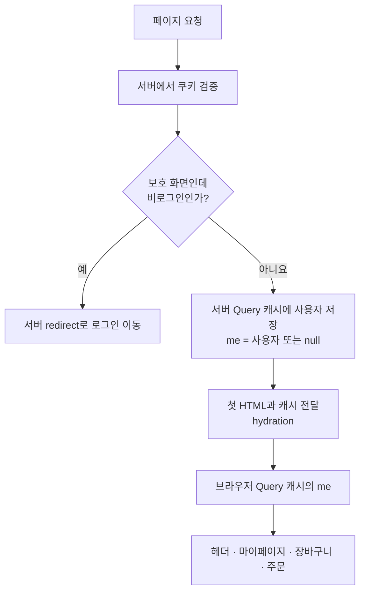
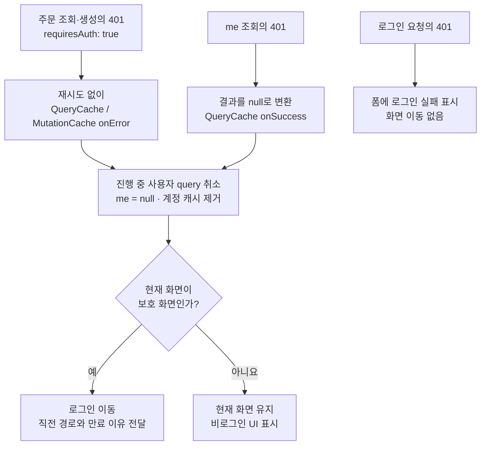

# 인증 상태와 401 처리 구조 개편 계획

상태: 구현 완료 (2026-09-08). 확정 사항은 문서 끝의 [구현 기록](#구현-기록-2026-09-08) 참고.

후속 설계 수정: [세션 교체와 주문 완료 후처리 정리](260908-session-transition.spec.md). 공통 세션 교체 절차와 늦은 주문 성공 후 이동 조건은 후속 스펙을 적용한다.

## 목표

서버는 세션의 유효성을 판단하고, 브라우저의 사용자 정보는 TanStack Query의 `['me']` 캐시 한 곳에서 관리한다. 인증 실패에 따른 캐시 정리와 화면 접근 정책을 구분해 공개 화면, 보호 화면, 로그인 폼이 각자의 목적에 맞게 동작하게 한다.

서버 인증 로직과 기존 상품·장바구니·위시리스트 기능을 재사용하면서 인증 관련 상태 소유권, Provider 연결, 서버 페이지, 테스트를 함께 정리한다.

## 현재 코드에서 확인한 내용

- 작업 시작 시 Git 작업 트리는 깨끗하다. 전역 콜백 등록 방식은 롤백되어 있다.
- `src/shared/get-query-client.ts`는 query와 mutation의 401을 `throwOnError`로 Error Boundary에 전달한다.
- `src/app/(commerce)/error.tsx`가 사용자 초기화, 주문 캐시 제거, 분석 식별 초기화, 로그인 이동을 맡는다.
- `src/entities/session/model/session-store.tsx`의 Zustand Provider에 서버가 확인한 사용자를 전달한다. `/api/auth/me`를 읽는 클라이언트 쿼리는 없다.
- `src/proxy.ts`는 `/orders` 하위의 쿠키 서명과 만료를 검사한다. 주문 서버 페이지 자체에는 세션 검사와 주문 데이터 선조회가 없다.
- `readSessionToken`은 이미 서명·만료·사용자 존재를 검증한다. 인증 API와 주문 API에서도 이 함수를 사용한다.
- 주문 query key에는 사용자 ID가 있다. 주문 조회 함수는 아직 Query의 `AbortSignal`을 전달하지 않는다.
- 만료 시 checkout draft는 보존하고, 명시적 로그아웃 시에는 제거한다. 장바구니와 위시리스트는 두 경우 모두 보존한다.

## 제안 구조

| 위치                     | 소유할 책임                                                                |
| ------------------------ | -------------------------------------------------------------------------- |
| `app`의 서버 세션 모듈   | 기존 `readSessionToken`을 이용한 현재 요청의 세션 확인, 보호 페이지용 검사 |
| 보호 서버 페이지         | 세션 확인과 접근 판단, 인증 실패 시 서버 `redirect`                        |
| `entities/session`       | 현재 사용자 query, `SessionUser \| null`, 사용자 캐시 갱신·정리 함수       |
| `entities/order`         | 사용자 ID별 주문 query, 인증이 필요한 요청이라는 metadata                  |
| `app`의 QueryClient 구성 | QueryCache·MutationCache 콜백 연결, 인증 실패와 앱의 이동·계측 정책 조합   |
| `features/auth`          | 로그인·로그아웃 사용자 행동, 로그인 URL 검증과 폼 오류 표시                |
| `shared`                 | HTTP 오류 전달, 도메인을 모르는 QueryClient 기본 생성 설정                 |

`shared → features/auth` 또는 `entities/session → entities/order` 의존은 만들지 않는다. 앱 조합은 `app`에 두고, 계정 query 정리는 metadata로 대상을 고른다. QueryClient의 브라우저 인스턴스 소유권도 앱 구성에 둬 기본 client와 인증 정책이 설정된 client가 따로 생기지 않게 한다. 서버 선조회는 공통 생성 함수를 사용해 요청 간 캐시를 공유하지 않는다.

### 1. 서버 세션과 첫 HTML

- 토큰 발급·검증 알고리즘은 기존 구현을 재사용한다. 쿠키를 읽는 서버 전용 함수를 만들어 layout과 보호 페이지에서 사용한다.
- 서버가 확인한 사용자를 요청별 QueryClient의 `['me']`에 넣고 `dehydrate`/`HydrationBoundary`로 전달한다. 헤더를 비롯한 클라이언트 UI는 이 캐시를 읽는다.
- 첫 HTML에서도 로그인 사용자 이름을 표시하고, hydration 직후 동일한 `/api/auth/me` 요청을 반복하지 않는다.
- 기본 제안은 사용자 query의 `staleTime` 60초, 주기적 polling 없음이다. 오래된 캐시의 마운트·창 포커스·재연결에서는 재조회할 수 있다. 60초는 토큰 만료 시간이나 자동 연장 주기가 아니라, `/me` 재요청(응답 지연 500ms)을 마운트·포커스마다 반복하지 않으면서 외부 변화를 분 단위 안에 따라잡는 절충값이다. 정밀한 산정 근거가 있는 수치는 아니다.
- `/orders` 서버 페이지는 세션을 확인한 뒤 주문 화면을 렌더링한다. 주문 내역은 브라우저의 `useQuery`로 조회하며, 같은 origin 요청의 쿠키는 브라우저가 포함한다. 조회 함수는 쿠키 인자를 받지 않고 `cache: 'no-store'`를 적용한다. 주문 조회의 401은 앱 QueryCache에서 처리한다.
- `/orders/new`는 서버에서 세션을 확인한 뒤 주문서를 렌더링한다. 주문 제출 API도 요청 시점에 다시 검증한다.
- 기존 proxy는 조기 접근 검사로 유지한다. 실제 API 검증이나 보호 페이지 검사를 대신하는 것으로 취급하지 않는다. proxy는 렌더 비용 없이 이른 시점에 차단하는 1차 검사이고, 페이지·API의 재검증은 그 사이에 만료되는 경우까지 막는다.
- 서버 최초 진입에서도 `scenario=expired` 쿠키를 일관되게 해석한다. 시나리오 API의 응답 계약은 유지한다.

### 2. 클라이언트 인증 실패

| 요청 또는 상황                              | 처리                                                                                      |
| ------------------------------------------- | ----------------------------------------------------------------------------------------- |
| `requiresAuth: true`인 query/mutation의 401 | 재시도 없이 사용자 query 취소·정리, `['me'] = null`                                       |
| 위 실패가 `/orders` 하위 화면에서 발생      | 직전 경로와 만료 이유를 담아 로그인으로 이동                                              |
| 위 실패가 공개 화면에서 발생                | 페이지 유지, 비로그인 UI와 해당 행동의 로그인 안내 표시                                   |
| `/me`의 401                                 | query 결과를 `null`로 변환. 사용자 query 정리에도 연결하고, 공개 화면에서는 이동하지 않음 |
| 로그인 mutation의 401                       | 폼 오류만 표시. 다른 계정 상태를 전역에서 초기화하지 않음                                 |
| 403·500·네트워크 오류                       | 인증 만료로 해석하지 않음. 각 화면의 오류·재시도 처리 유지                                |

- `requiresAuth`는 요청이 세션을 필요로 한다는 뜻이다. 화면을 이동시킬지는 현재 화면의 접근 정책으로 따로 결정한다. 보호 화면은 `/orders`와 그 하위뿐이다(proxy matcher와 같은 기준). `/my`와 장바구니는 비로그인에게도 로그인 안내와 메뉴를 보여줘야 하는 공개 화면이다.
- query와 mutation 모두 공통 콜백으로 처리한다. 주문 생성에는 자동 재시도를 사용하지 않는다.
- `/me`의 401을 오류가 아니라 `null` 데이터로 다루는 이유: 비로그인은 이 API의 정상 답이라서다. 소비처는 에러 파싱 없이 `user === null`로 분기하고, 재시도와 에러 상태가 생기지 않는다.
- `/me`의 401을 `null`로 변환하면 `onError`가 실행되지 않으므로, 해당 query가 `null`로 성공한 경우도 QueryCache의 `onSuccess`에서 정리 흐름에 연결한다. 로그인 상태를 변경하는 명시적 캐시 갱신은 해당 인증 동작에서 처리한다.
- 정리 대상은 진행 중인 `/me`와 계정 query다. 취소 후 `['me']`를 `null`로 바꾸고 계정 query를 제거한다. 상품 캐시는 유지한다.
- 늦은 응답이 만료 전 사용자나 주문을 복구하지 않는지 검증한다. 취소(`cancelQueries`)가 진행 중 조회의 결과를 무시시키므로 `AbortSignal` 전달은 두지 않는다(구현 기록 참고).
- 여러 401이 겹쳐도 정리와 로그인 이동이 중복되지 않게 한다. 재로그인 뒤에는 다음 만료를 다시 처리할 수 있어야 한다.
- 로그인 화면에서 늦게 도착한 실패가 `next`를 로그인 URL로 덮어쓰지 않게 한다.
- mutation 취소가 이미 서버에서 실행된 주문을 취소한다고 가정하지 않는다. 계정 변경 이후 이전 요청의 UI 후처리가 새 상태를 덮지 않도록 확인한다.

### 3. 화면 이동 기본안

현재 추천 초안은 보호 화면의 세션 만료 시 `window.location.replace`로 로그인 문서를 새로 받는 것이다. QueryClient 생성 시 앱의 콜백을 연결하고, 실행 시점의 경로를 읽는다. 전역 함수 등록용 `useEffect`와 등록·해제 변수는 만들지 않는다 — 이전 반복에서 전역 콜백 등록 방식을 시도했다 롤백한 이력 때문이다("현재 코드에서 확인한 내용" 첫 항목).

로그인·로그아웃 완료도 문서 이동으로 통일하는 안을 제안한다. 서버가 변경된 쿠키로 화면을 다시 만들고, 이전 QueryClient의 메모리와 중복 이동 플래그가 다음 로그인까지 남지 않는다. 만료 후 이어갈 checkout draft는 기존 `sessionStorage`에서 복원한다.

이 선택은 구현하면서 문서 이동으로 확정했다(구현 기록 참고). 검토했던 대안은 공통 보호 layout에서 `['me']`를 읽어 화면 접근을 처리하는 클라이언트 라우터 이동으로, 그 경우 캐시·라우터 갱신과 중복 이동 제어의 수명을 별도로 검증해야 한다. 두 방식을 동시에 구현하지 않는다.

### 4. 로그인·로그아웃과 소비 화면

- 로그인 성공 시 진행 중인 이전 사용자 query를 정리하고, 응답의 사용자를 `['me']`에 기록한 뒤 안전한 복원 경로로 이동한다. 안전한 경로란 같은 origin의 내부 경로만 뜻하며(`//` 시작 등 외부 유도는 홈으로 대체), 판정은 `toSafeNextPath` 한 곳에서 한다.
- 잘못된 로그인 정보와 로그인 API 장애는 기존 폼에서 처리한다.
- 로그아웃 API 성공 시 사용자·주문 캐시와 checkout draft를 정리한다. 실패하면 로그인 상태를 임의로 지우지 않고 재시도할 수 있게 한다.
- 세션 만료 시 logout API 성공을 기다리지 않는다. 장바구니·위시리스트·checkout draft를 보존한다.
- `SessionMenu`, `MyPage`, `CartPage`, `OrdersPage` 등 모든 소비처를 같은 사용자 query로 전환한다. Zustand의 세션 store와 Provider는 제거한다.
- `user === null`과 조회 실패를 구분한다. `/me`의 500이나 네트워크 실패로 기존 사용자를 지우지 않으며, 캐시가 없는 조회 실패에는 확인 실패·재시도 UI를 표시한다.
- 분석 식별은 로그인·비로그인 전환과 일치시킨다. `login_success`, `order_complete` 등 기존 이벤트는 유지한다.
- `error.tsx`는 예상하지 못한 오류의 fallback으로 되돌리고 인증 분기를 제거한다.

## 흐름 다이어그램

아래 그림은 구현할 구조의 초안이다. 서버는 세션을 검증하고, 브라우저의 화면들은 Query 캐시에 담긴 사용자 정보를 함께 읽는다.

### 첫 화면을 열 때

공개 화면은 비로그인이어도 `me = null`로 렌더링한다. 주문 내역은 첫 HTML에 로딩 상태를 표시한 뒤 브라우저에서 조회한다. 서버가 확인한 사용자 정보의 hydration은 유지하며, 주문 API도 실제 데이터 요청마다 세션을 다시 검증한다.

### 브라우저에서 요청이 401로 실패할 때

요청의 `requiresAuth`는 인증 실패를 공통 처리할지 결정하고, 현재 화면의 접근 정책은 로그인으로 이동할지 결정한다. `/me`의 500·네트워크 오류는 `null`로 바꾸지 않으며, 위 비로그인 전환에 포함하지 않는다.

## 작업 순서

1. **서버 경계 정리:** 서버 세션 함수와 보호 페이지 검사를 연결한다. 주문 데이터 조회는 브라우저가 맡는다.
2. **사용자 query 도입:** `/me`의 401만 `null`로 변환하고, 서버 사용자 데이터를 hydration한다.
3. **앱 QueryClient 구성:** 기본 생성 설정과 앱 인증 정책을 분리하고 QueryCache·MutationCache의 공통 처리를 연결한다.
4. **소비처와 인증 동작 전환:** 헤더·마이페이지·장바구니·주문과 로그인·로그아웃을 Query 기준으로 바꾼다.
5. **기존 인증 장치 제거:** Zustand 세션 Provider, 401의 `throwOnError`, `error.tsx`의 인증 처리를 삭제한다.
6. **검증과 문서 정리:** 새 동작을 검증하도록 기존 테스트를 교체·보강하고 변경된 설계 근거를 기록한다.

작업 중간의 이중 저장은 임시 이행 상태로만 허용하며, 완료 상태에는 사용자 정보의 클라이언트 저장소가 하나만 남는다.

## 완료 조건

- [x] 첫 서버 HTML에 사용자 이름이 있고, hydration 직후 `/me` 중복 요청이 없다.
- [x] 서버 QueryClient 사이에 사용자·주문 캐시가 공유되지 않는다.
- [x] 서버 최초 진입, 클라이언트 주문 재조회, 주문 생성에서 각각 만료를 처리한다.
- [x] 주문 서버 페이지는 세션 검사만 수행하고, 브라우저 조회로 주문 내역과 오류·재시도 UI를 표시한다.
- [x] 보호 query와 mutation의 401은 재시도·Error Boundary 전파 없이 처리한다.
- [x] 공개 `/my`·상품 화면은 `/me`의 401 이후에도 유지되며 비로그인 UI를 표시한다.
- [x] `/me`의 401 이후 기존 주문 캐시가 제거되고, 500·네트워크 오류에는 사용자 캐시가 유지된다.
- [x] 로그인 401은 폼에 표시되고 전역 만료 처리를 일으키지 않는다.
- [x] 동시 401은 로그인 이동 한 번으로 처리되고, 재로그인 후 다음 만료도 처리된다.
- [x] 취소된 늦은 조회 응답이나 이전 계정의 후처리가 사용자·주문 상태를 되살리지 않는다.
- [x] 안전한 `next` 복원, 로그인 URL로의 반복 이동 방지, 장바구니·위시리스트 보존을 확인한다.
- [x] checkout draft는 만료·재로그인 왕복에서 보존되고 명시적 로그아웃에서 제거된다.
- [x] 실제 브라우저에서 인증·주문 핵심 흐름과 기존 분석 이벤트를 확인한다. 재로그인 검증 시 테스트용 만료 시나리오를 명시적으로 해제한다. (판정 방법: playwright-cli 수동 검증 — 로그인·주문 이벤트 시퀀스, 첫 HTML의 사용자 이름, 만료↔재로그인 왕복의 draft 보존 확인)
- [x] `pnpm test`, `pnpm lint`, `pnpm typecheck`, `pnpm build`와 변경 범위에 해당하는 E2E를 통과한다.
- [x] 구현 후 `/self-review`를 수행한다.

## 범위 밖

- Refresh token, 자동 세션 연장, 주기적 polling, 탭 간 실시간 동기화
- 새로운 인증 라이브러리나 외부 의존성, Next.js·TanStack Query 버전 변경
- 상품·장바구니·위시리스트의 상태 관리 방식 변경
- 토큰 암호화 방식 또는 인증 API 응답 계약의 재설계

## 근거

- [Next.js 인증 가이드](https://nextjs.org/docs/app/guides/authentication): 조기 검사와 실제 데이터 접근 지점의 검증 구분.
- [TanStack Query 서버 렌더링 가이드](https://tanstack.com/query/latest/docs/framework/react/guides/advanced-ssr): 서버 캐시 격리, 안정적인 브라우저 client, hydration.
- [TanStack Query 취소 가이드](https://tanstack.com/query/latest/docs/framework/react/guides/query-cancellation): `cancelQueries`의 의미론 — 상태 되돌림과 늦은 응답 무시는 signal 소비 없이도 성립하고, signal은 네트워크 중단을 더할 뿐이다.

## 구현 기록 (2026-09-08)

주문 내역은 브라우저에서 조회하기로 사용자와 합의했다. 서버의 세션 검사와 사용자 정보 hydration은 유지하고, 주문 서버 선조회와 수동 쿠키 전달을 제거했다. 첫 HTML에 주문 데이터까지 포함하는 것보다 조회 구조를 단순하게 유지하는 쪽을 선택했다. 주문 E2E에서 브라우저의 주문 표시와 최초 HTML의 로딩 상태를 함께 검증한다.

이 변경의 자체 검증: 단위·통합 396개, 인증·주문·만료 E2E 5개, E2E 준비 단계의 production build, lint, typecheck 통과.

3절의 화면 이동은 기본안대로 **문서 이동(`window.location.replace`)** 으로 확정했다. 로그인·로그아웃 완료도 문서 이동으로 통일해, 서버가 변경된 쿠키 기준의 화면을 새로 그리고 이전 QueryClient 메모리와 중복 이동 플래그가 다음 세션으로 이어지지 않는다.

- 중복 이동 방지 플래그는 `makeAppQueryClient`(src/app/query-client.ts) 클로저에 둬 client와 수명을 묶었다. 문서 이동으로 client가 새로 만들어지면 다음 만료를 다시 처리한다.
- 문서 이동은 `shared/navigation.ts`의 `replaceDocument` 한 겹을 거친다. jsdom이 실제 이동을 구현하지 않아 테스트가 이 지점을 mock으로 받기 위한 것으로, 다른 용도는 없다.
- 계정 query 정리는 `meta.requiresAuth` predicate로 골라 `features/auth → entities/order` 의존을 없앴다. meta 타입은 `shared/query-client.ts`의 Register 확장에 있다.
- 로그인 성공 시 `['me']`뿐 아니라 진행 중인 계정 query도 취소한다. 이전 화면이 남긴 조회의 늦은 401이 새 로그인 사용자를 만료로 지우는 경합을 리뷰(Codex)가 재현해 반영했다.
- 리뷰의 "만료 뒤 도착한 주문 성공(201)이 draft를 지운다" 지적은 의도된 동작으로 판단해 반영하지 않았다. 주문이 서버에서 실제로 생성됐으므로 draft를 지워야 재로그인 후 같은 draft로 중복 주문하는 것을 막는다. 2절의 "이미 서버에서 실행된 주문을 취소한다고 가정하지 않는다"와 같은 판단이다.
- 3차 리뷰의 "다른 탭 계정 전환 뒤 이전 계정 요청의 늦은 401이 새 계정을 만료시킨다" 지적은 반영하지 않았다. 단일 탭의 계정 전환(로그인·로그아웃·만료)은 모두 문서 이동이라 이전 요청이 살아남지 않고, 이 시나리오는 범위 밖인 탭 간 동기화의 수 초 틈새 경합이며 결과도 로그인 재확인으로 안전하게 수렴한다. 계정 전환 감지 시 계정 query를 일괄 취소하는 수정은 단일 탭에서 진행 중인 주문 조회를 복구 없이 끊는 위험이 더 크다. 같은 이유로 "첫 /me 재확인의 identify 1회 중복"도 멱등 재설정이라 그대로 둔다.
- AbortSignal 전달은 구현 초안에 있었으나 뺐고, 본문 2절도 그에 맞게 고쳤다. `cancelQueries`는 signal 소비와 무관하게 query를 되돌리고 늦은 응답을 무시하므로 "늦은 응답이 사용자·주문을 복구하지 않는다"는 조건은 그것만으로 충족되고(테스트로 검증), 만료·로그인의 문서 이동이 이동 시점의 진행 중 요청을 어차피 브라우저 수준에서 끊는다. signal의 실익은 공개 화면 만료 정리 때 요청 몇 개가 완주하는 네트워크 낭비 절약뿐이라, 모든 조회 함수에 전달 배관을 강요하지 않기로 했다.
